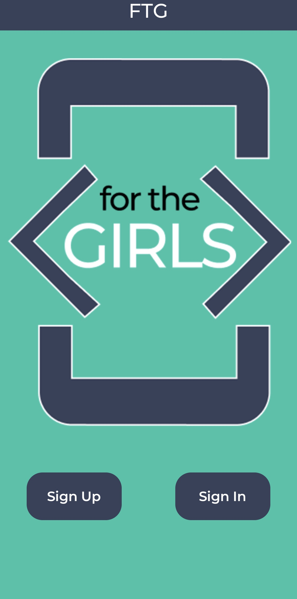
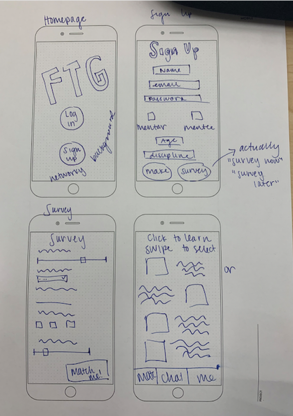
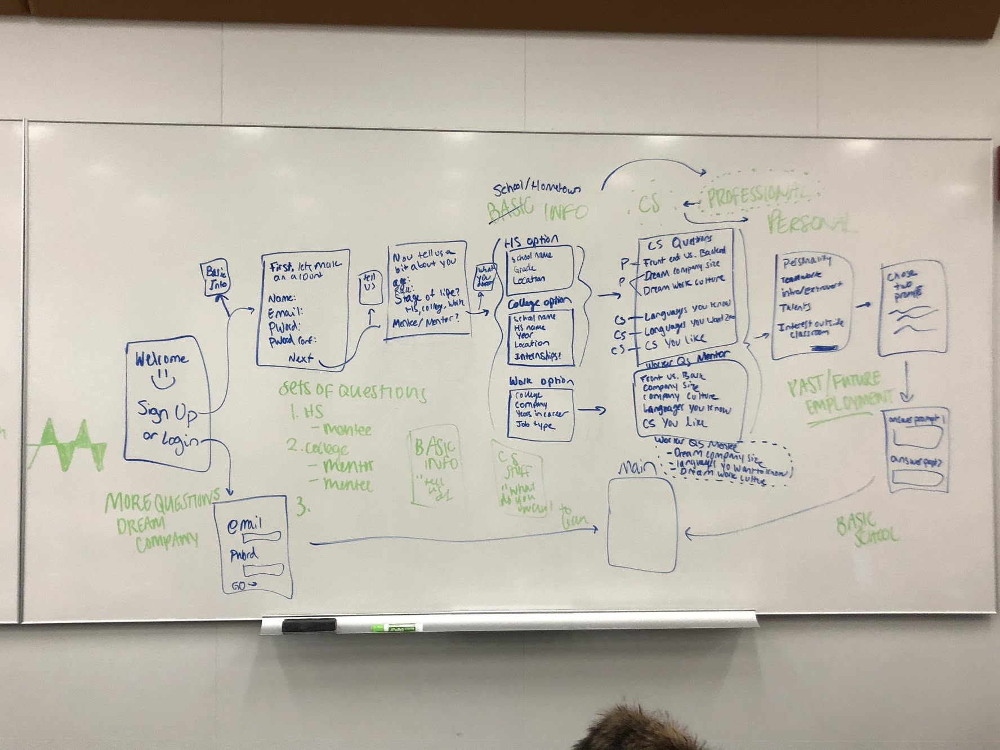
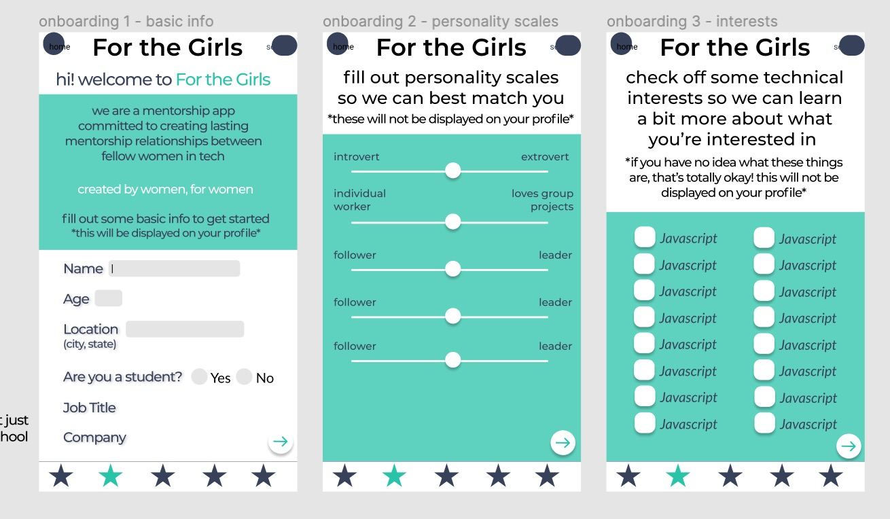

# For the Girls

For the Girls is a mobile application that connects women in technology based on technical and personal interests with the goal of creating new friendships and mentorship relationship. Once women match, they can DM each other to see if they want to meet up in person for coffee or a meal. Through an events page, personality matching and chat function, we hope that the relationships and networks built through the app will last. Our goal is to alliviate feelings of isolation and imposter syndrome through building a strong network of women in technology. 

## Architecture

To build our front end, we are using React Native. We used the Node.js framework for our project. In addition to this, we use Expo which provides tools to create a React Native application. We use axios to enable us to make API calls and eslint and babel as other libraries to help us build our application.

We are using React Navigation to control navigating throughout the app. The main process through the app is controlled in the MainTabBar which controls which tab the user clicks on on the bottom tab bar and navigates there. The main tab bar has links to matches, profile, events and chat. However, before the user can get to the main tab bar, the must either sign up or in to their account through the signup stack. This process of signing up looks like the image bellow.

The other stack navigator we have created is the event stack which determines if a user has clicked on an event or not, and if so shows that event.  All of our navigators are in the  `navigation` folder.

We also are using reducers and actions to work with our backend. We have  an auth reducer to keep track of the users, and then we also have event, error and user reducer to keep profile info, events info and error information. These are all  in the reducers folder and the corresponding actions are in action.js.

Our styling is all in assets.js and it corresponds to the style from the Figma such as the image bellow.

To style, we are using some helpful components from NPM such as `react-native-text-field` which lets the user input text and `react-native-material-dropdown` which allows the user to choose from a dropdown menu.

## Setup

In order to set this up, you must set up the following by running this code in the command line (to make sure you have node and expo):

`brew install node`

`npm install expo-cli --global`

Then you should run:

`yarn install` to install any packages or libraries you may need.

## Deployment

To deploy the project, clone this repository. Then, do the setup above if you haven't already from the command line. Then, run `expo start` to deploy the project.

Our application is also available on test flight from the following link:

## Authors

Sami Burack, Frances Cohen, Alexis Harris, Annika Kouhia and Morgan Sorbaro

## Acknowledgments

Thank you to Tim for the resources provided on the CS 98 and CS 52 websites and the TA's of CS 98 for the feedback and support!
